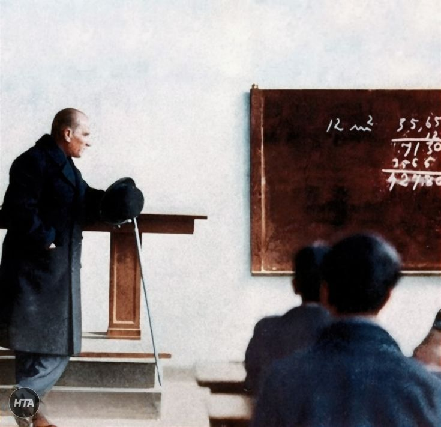

# 📚 YKS Çalışma Takip Sistemi

Siz ülkemizin geleceği gençler için modern ve kullanıcı dostu bir YKS (TYT & AYT Sayısal) çalışma takip uygulaması.

---

## ✨ Özellikler

### 📖 Konu Takibi
- **TYT Dersleri:** Türkçe, Matematik, Geometri, Fizik, Kimya, Biyoloji, Tarih, Coğrafya, Felsefe, Din Kültürü
- **AYT Sayısal Dersleri:** Matematik, Geometri, Fizik, Kimya, Biyoloji
- Tüm konular ve alt konular (sayısal dersler için) detaylı şekilde listelenmiş
- Tek tıkla konu tamamlama
- Her ders için ayrı ilerleme yüzdesi

### 📊 İstatistikler & Grafikler
- TYT, AYT ve toplam ilerleme yüzdeleri
- Her ders için görsel ilerleme çubukları
- Motivasyon artırıcı sözler

### 📋 Deneme Analizi
- TYT ve AYT denemeleri için doğru/yanlış/boş girişi
- Otomatik net hesaplama
- Yanlış yapılan konuları seçme
- Deneme geçmişi görüntüleme
- Deneme düzenleme ve silme
- **En çok yanlış yapılan konular** listesi
- "Tekrar Ettim" butonu ile çalışılan konuları temizleme

### 👤 Kullanıcı Sistemi
- Kullanıcı adı ile giriş
- Tüm veriler tarayıcıda saklanır (localStorage)
- Veriler kapanınca kaybolmaz

### 🎨 Tasarım
- Pastel renkli, göz yormayan arayüz
- Mobil uyumlu (responsive) tasarım
- Akıcı ve hızlı performans
- Modern ve şık görünüm

---

## 🚀 Kurulum

Herhangi bir kurulum gerektirmez! Sadece:

1. `index.html` dosyasını indirin
2. Tarayıcınızda açın
3. Kullanmaya başlayın!

---

## 📱 Kullanım

### İlk Giriş
1. Kullanıcı adınızı girin
2. "Başla" butonuna tıklayın

### Konu Takibi
1. TYT veya AYT sekmesine gidin
2. İlgili derse tıklayın
3. Tamamladığınız konuları işaretleyin
4. Sayısal derslerde alt konuları görmek için ok butonuna tıklayın

### Deneme Ekleme
1. "Deneme Analizi" sekmesine gidin
2. TYT veya AYT seçin
3. Tarihi belirleyin
4. Her ders için doğru ve yanlış sayılarını girin
5. "Yanlış Konular" butonuna tıklayıp yanlış yaptığınız konuları seçin
6. "Denemeyi Kaydet" butonuna tıklayın

### Eksik Konuları Takip
- "En Çok Yanlış Yapılan Konular" bölümünden eksiklerinizi görün
- Tekrar ettiğiniz konular için "Tekrar Ettim" butonuna tıklayın

---

---

## 💜 Katkıda Bulunma

Bu proje sevgiyle yapılmıştır. Geliştirmek isterseniz:

1. Fork yapın
2. Yeni bir branch oluşturun (`git checkout -b yeni-ozellik`)
3. Değişikliklerinizi commit edin (`git commit -m 'Yeni özellik eklendi'`)
4. Branch'inizi push edin (`git push origin yeni-ozellik`)
5. Pull Request açın

---

## 📝 Lisans

Bu proje MIT lisansı altında sunulmaktadır. Dilediğiniz gibi kullanabilir, değiştirebilir ve dağıtabilirsiniz.

---

## 🌟 Teşekkürler

YKS yolculuğunuzda başarılar! Düzenli çalışma ve takip, başarının anahtarıdır. 

---

  

  <i>"Gelecek için hazırlanan vatan evlatlarına, hiçbir güçlük karşısında yılmayarak tam bir sabır ve metanetle çalışmalarını ve öğrenim gören çocuklarımızın ana ve babalarına da yavrularının öğreniminin tamamlanması için hiçbir fedakarlıktan çekinmemelerini tavsiye ederim."</i>

  <b>— Gazi Mustafa Kemal Atatürk</b>

---

  Made with 💜 for YKS students

